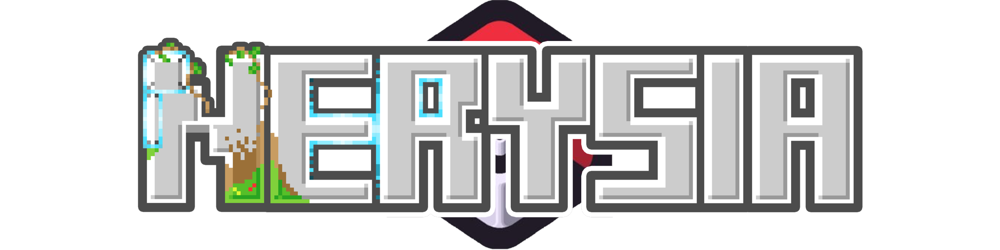
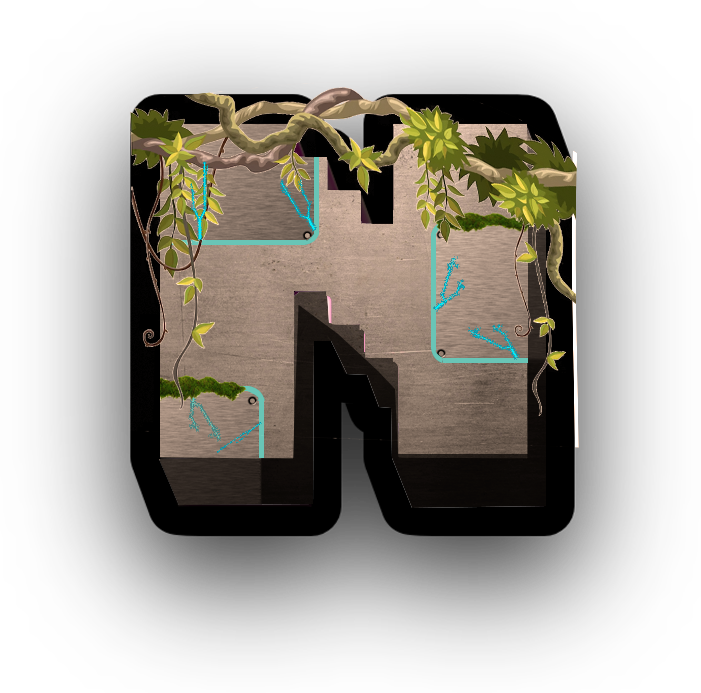

<p align="center"></p>

<h1 align="center">Nerysia Launcher</h1>

<p align="center">Le launcher officiel de <b>Nerysia</b>, serveur Minecraft <b>Cobblemon</b> français.<br>
Un clic pour jouer : Java, Minecraft, Fabric, les mods et les configs s'installent tout seuls.</p>

<p align="center">
  <a href="https://github.com/Lightshadow02/Nerysia-LAUCHER/releases/latest"></a>
  <a href="https://github.com/Lightshadow02/Nerysia-LAUCHER/releases"></a>
  <a href="https://github.com/Lightshadow02/Nerysia-LAUCHER/actions/workflows/release.yml"></a>
  <a href="https://discord.gg/dtvMfS69hU"></a>
</p>

---

## 📑 Sommaire

- [Télécharger](#-télécharger)
- [Fonctionnalités](#-fonctionnalités)
- [Préréglages de performance](#-préréglages-de-performance)
- [Configuration conseillée](#-configuration-conseillée)
- [Besoin d'aide ?](#-besoin-daide-)
- [Pour les développeurs](#-pour-les-développeurs)
- [Gérer le modpack (admins)](#-gérer-le-modpack-admins)
- [Crédits et licence](#-crédits-et-licence)

---

## 📥 Télécharger

👉 **[Page de téléchargement (dernière version)](https://github.com/Lightshadow02/Nerysia-LAUCHER/releases/latest)**. Les fichiers sont tout en bas, dans la rubrique **Assets**.

| Ton système | Fichier à prendre |
|---|---|
| 🪟 Windows 10 / 11 | `Nerysia-Launcher-setup-X.Y.Z.exe` |
| 🍎 Mac avec puce Apple (M1, M2, M3, M4…) | `Nerysia-Launcher-setup-X.Y.Z-arm64.dmg` |
| 🍎 Mac avec processeur Intel | `Nerysia-Launcher-setup-X.Y.Z-x64.dmg` |
| 🐧 Ubuntu, Debian, Linux Mint, Pop!_OS | `Nerysia-Launcher-setup-X.Y.Z.deb` |
| 🐧 Arch Linux, Manjaro, EndeavourOS | `Nerysia-Launcher-setup-X.Y.Z.pacman` |
| 🐧 N'importe quel Linux | `Nerysia-Launcher-setup-X.Y.Z.AppImage` |

📖 **Guide d'installation pas à pas pour chaque système : [docs/INSTALLATION.md](docs/INSTALLATION.md)**

> [!NOTE]
> Le launcher n'est pas signé avec un certificat payant. Windows (SmartScreen) et macOS (Gatekeeper) affichent donc un avertissement au premier lancement. C'est normal, et le [guide d'installation](docs/INSTALLATION.md) explique comment le passer.

---

## ✨ Fonctionnalités

| | Fonctionnalité | Détail |
|---|---|---|
| ☕ | **Java automatique** | Pas besoin d'installer Java : le launcher télécharge la bonne version tout seul |
| 📦 | **Modpack toujours à jour** | Mods, configs, resource packs et shaders sont téléchargés et vérifiés (MD5) à chaque lancement. Un fichier corrompu ou manquant est retéléchargé |
| ⚡ | **Préréglages Faible / Moyen / Ultra** | Choisis les mods chargés selon la puissance de ton PC ([voir plus bas](#-préréglages-de-performance)) |
| 🏗️ | **Mode Builder** | Une case à cocher pour ajouter les outils de construction (Litematica…) |
| 🔐 | **Compte Microsoft** | Connexion officielle Microsoft. Tu peux ajouter plusieurs comptes et passer de l'un à l'autre |
| 🔄 | **Mises à jour du launcher** | Automatiques sur Windows et Linux (AppImage). Sur Mac, le launcher te prévient |
| 📰 | **Actualités** | Les news du serveur s'affichent directement dans le launcher |
| 🟢 | **Statut du serveur** | Nombre de joueurs connectés visible avant de lancer |
| 🌗 | **Thème jour / nuit** | Fond clair de 7h à 19h, sombre le reste du temps |
| 🧩 | **Mods perso** | Tu peux ajouter tes propres mods compatibles (Paramètres → Mods → Drop-in Mods) |
| ⚙️ | **Réglages Java** | RAM allouée, exécutable Java, arguments JVM (Paramètres → Java) |

---

## ⚡ Préréglages de performance

Dans **Paramètres → Mods**, choisis le préréglage adapté à ton PC :

| Préréglage | Pour qui | Mods chargés |
|---|---|---|
| **Faible** | Petits PC, portables, vieilles cartes graphiques | Uniquement l'essentiel pour jouer (+ tous les mods d'optimisation : Sodium, Lithium, FerriteCore…) |
| **Moyen** *(par défaut)* | La plupart des PC | Essentiel + confort : inventaire, chat, textures connectées, sons d'ambiance, skins 3D… |
| **Ultra** | PC puissants | Tout, y compris **Iris** pour les shaders |
| **+ Builder** | Constructeurs | S'ajoute à n'importe quel préréglage : **Litematica** |

Tu peux toujours activer ou désactiver un mod à la main juste en dessous. Le launcher affiche alors « Réglage personnalisé ».

---

## 💻 Configuration conseillée

| | Minimum | Conseillé |
|---|---|---|
| **Système** | Windows 10 64 bits, macOS 12, Linux 64 bits | Windows 11, macOS 13+ |
| **Mémoire (RAM) du PC** | 8 Go | 16 Go |
| **RAM allouée au jeu** (Paramètres → Java) | 4 Go | 6 à 8 Go |
| **Espace disque** | 3 Go | 5 Go (shaders, mondes, captures) |
| **Connexion** | Premier lancement : ~700 Mo à télécharger | |
| **Compte** | Compte Microsoft **possédant Minecraft Java Edition** | |

**Le serveur** : Minecraft **1.21.1**, Fabric, environ **120 mods** (Cobblemon et ses addons, meubles, décoration, quêtes, factions, chat vocal Plasmo Voice…).

---

## 🆘 Besoin d'aide ?

| Problème | Solution |
|---|---|
| Le jeu rame | Paramètres → **Mods** → préréglage **Faible**, et vérifie la RAM dans Paramètres → **Java** |
| Avertissement Windows / Mac au lancement | Suis le [guide d'installation](docs/INSTALLATION.md) |
| Le jeu crashe au démarrage | Désactive tes mods perso (Drop-in Mods), puis relance |
| Erreur de téléchargement | Vérifie ta connexion et relance : le launcher reprend là où il s'est arrêté |
| Autre chose | 💬 **[Discord Nerysia](https://discord.gg/dtvMfS69hU)** ou [signaler un bug](https://github.com/Lightshadow02/Nerysia-LAUCHER/issues) |

---

## 🛠️ Pour les développeurs

Le launcher est une application [Electron](https://www.electronjs.org/) basée sur [Helios Launcher](https://github.com/dscalzi/HeliosLauncher) et sa bibliothèque [helios-core](https://github.com/dscalzi/helios-core).

### Prérequis

- [Node.js](https://nodejs.org/) **v20**
- Git

### Lancer en développement

```console
git clone https://github.com/Lightshadow02/Nerysia-LAUCHER.git
cd Nerysia-LAUCHER
npm install
npm start
```

### Construire les installateurs en local

| Plateforme | Commande |
|---|---|
| Système actuel | `npm run dist` |
| Windows | `npm run dist:win` |
| macOS (sur un Mac uniquement) | `npm run dist:mac` |
| Linux | `npm run dist:linux` |

Sans certificat de signature : `CSC_IDENTITY_AUTO_DISCOVERY=false` (PowerShell : `$env:CSC_IDENTITY_AUTO_DISCOVERY = "false"`). Ajoute `-- -p never` pour ne rien publier.

### Publier une nouvelle version

Tout est automatique via GitHub Actions ([release.yml](.github/workflows/release.yml)) :

1. Mets à jour la version dans `package.json` (ex : `npm version 1.0.6 --no-git-tag-version`)
2. Commit + push
3. Crée et pousse le tag correspondant : `git tag v1.0.6 && git push origin v1.0.6`

GitHub construit alors **Windows, macOS (Intel + Apple Silicon) et Linux (AppImage, deb, pacman)** et publie la release. Les joueurs Windows et AppImage reçoivent la mise à jour automatiquement.

> [!IMPORTANT]
> Le tag doit être **identique** à la version de `package.json`, sinon le build s'arrête volontairement.

### Structure du projet

| Chemin | Contenu |
|---|---|
| `index.js` | Processus principal Electron (fenêtre, mises à jour, auth Microsoft) |
| `app/*.ejs` | Écrans du launcher (accueil, connexion, paramètres…) |
| `app/assets/js/` | Logique : lancement du jeu, comptes, config, distribution |
| `app/assets/css/launcher.css` | Styles |
| `app/assets/lang/_custom.toml` | Textes personnalisés Nerysia |
| `app/assets/images/backgrounds/` | Fonds d'écran jour (`clair/`) et nuit (`sombre/`) |
| `build/` | Icône et hook de signature macOS |
| `electron-builder.yml` | Configuration des installateurs |
| `tools/` | Scripts de génération du modpack |
| `docs/` | Documentation et `distribution.json` |

---

## 📦 Gérer le modpack (admins)

Le modpack est décrit par un fichier `distribution.json` hébergé sur `https://apk.nerysia.fr/nerysia-laucher/distribution.json`. Le launcher le lit à chaque démarrage. Il est **généré automatiquement** à partir des fichiers du FTP :

```
servers/Nerysia-1.21.1/
├── fabricmods/
│   ├── required/   → mods obligatoires (préréglage Faible)
│   ├── moyen/      → ajoutés en Moyen et Ultra
│   ├── ultra/      → ajoutés en Ultra
│   └── builder/    → ajoutés avec la case Builder
└── files/          → config/, resourcepacks/, shaderpacks/…
```

**Après avoir modifié le modpack sur le FTP**, deux façons de republier :

| Méthode | Comment |
|---|---|
| Depuis GitHub | Onglet **Actions** → **Update Modpack** → **Run workflow** (choisir `patch` / `minor` / `major`) |
| En local (drive FTP monté sur `Y:`) | `& "tools/generate-distribution.ps1" -Bump patch` |

Les scripts vérifient avant de publier :
- qu'aucun mod ne **dépend** d'un mod qui peut être désactivé (sinon crash chez les joueurs)
- qu'aucun dossier inconnu ne contient de jars (mods qui seraient oubliés)
- que le nombre de modules ne **chute pas** brutalement (scan FTP incomplet)
- qu'aucun fichier n'est illisible (MD5 faux)

La configuration (dossiers, exclusions, infos serveur, Fabric) est centralisée dans [`tools/distribution-config.json`](tools/distribution-config.json).

> [!WARNING]
> Tout ce qui est dans `files/` sur le FTP est **public**. N'y mets jamais de config serveur contenant des mots de passe (base de données, Redis…) : exclus-les via `excludePatterns`.

📚 Docs détaillées : [Guide modpack](docs/GUIDE_MODPACK.md) · [Procédure d'upload](docs/PROCEDURE_UPLOAD.md) · [News](docs/GUIDE_NEWS_SITE.md) · [Auth Microsoft / Azure](docs/AUTH_AZURE.md)

---

## ❤️ Crédits et licence

- Basé sur **[Helios Launcher](https://github.com/dscalzi/HeliosLauncher)** de Daniel D. Scalzi : merci à lui et aux contributeurs du projet.
- Adapté pour Nerysia par **Lightshadow02**.
- Distribué sous licence **MIT** : voir [LICENSE.txt](LICENSE.txt).

*Nerysia n'est pas affilié à Mojang, Microsoft ni à The Pokémon Company.*

<p align="center"><br><b>À bientôt en jeu !</b></p>
